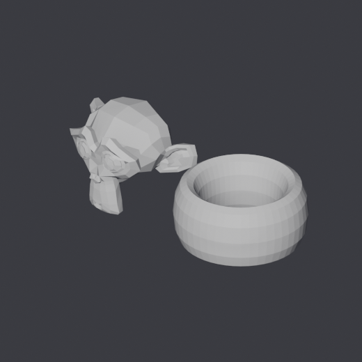
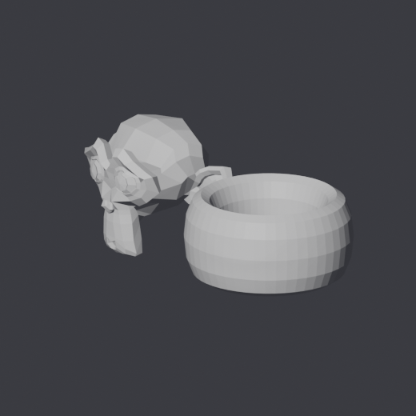

# blender-eyes

**Eyes and a ruler for AI agents working on Blender models they cannot see.**

An agent editing a `.blend` file is working blind. It moves a mesh, applies a
script, changes a scale — and then reports "done" based on what it *believes*
happened. On 3D geometry that is the fastest way to accumulate silent disasters.

`blender-eyes` gives an agent three things:

- **eyes** — repeatable renders it can open and actually look at
- **a ruler** — real measurements in metres it can assert on
- **a memory** — before/after comparison that says whether a change landed at all

No dependencies beyond Blender itself (plus Pillow + numpy for the comparison
step). Nothing to configure.



---

## Why this exists

I built it while an agent was working on a 20-headset VR installation with a
3.3-million-face model. It kept saying things were fixed. They were not, and
neither of us could tell, because nobody was looking.

The first time I pointed the finished tool at the real model, it found — on its
own, in three seconds — a set of defects that had previously cost days to
diagnose by hand: loose vertices skewing a module's bounding box, unwelded
geometry that would shatter under a "separate by parts" operation, and object
origins sitting outside their own bounds.

That is the point. It does not model for you. It removes the blindness.

## Install

```bash
git clone https://github.com/GPRizzi/blender-eyes.git
cd blender-eyes && chmod +x eyes scripts/*.py
```

Point `$BLENDER` at your Blender binary if it is not at the macOS default
(`/Applications/Blender.app/Contents/MacOS/Blender`):

```bash
export BLENDER=/usr/bin/blender     # Linux
```

The comparison step needs `pip install pillow numpy`. Rendering and inspection
do not.

## Use

### Look

```bash
./eyes render model.blend
./eyes render model.blend --only MainBody --views front,top,iso
./eyes render model.blend --label before
```

Renders into `.eyes/` from fixed viewpoints — `front, back, side, left,
top, bottom, iso` — with an orthographic camera and fixed lighting. Two renders
taken hours apart line up pixel for pixel, which is what makes comparison mean
anything.

The framing is computed from the bounding box **projected onto the camera
plane**, not from the longest edge, so isometric views do not clip the corners
of compact models.

Then **open the PNGs**. That is the one step you cannot delegate to a number.

#### Choose your own viewpoint

Presets are the repeatable baseline, but an agent often needs to look at
something specific — the seam between two parts, the underside of a joint, a
detail that no fixed view happens to show. So it can drive the camera:

```bash
./eyes render model.blend --angles "45,20 200,60"    # azimuth,elevation degrees
./eyes render model.blend --from "10,-4,3" --at "0,0,1.5"   # exact position
./eyes render model.blend --angles "90,0" --zoom 0.3        # close in
./eyes render model.blend --perspective --focal 35          # perspective
```

`--angles` takes `azimuth,elevation` pairs in degrees — azimuth turns around Z
(0 = front), elevation lifts above the horizon. It is the form an agent reasons
about most easily: *"let me look from 45 degrees around and 20 up"*. Each pair
becomes its own image, named `az45-el20.png`.

`--at` moves what the camera aims at, so you can frame a detail instead of the
whole bounding box. `--zoom 0.3` renders three tenths of the frame width — a
close-up. Every one of these still writes its exact camera parameters to
`manifest.json`, so a custom angle is as repeatable as a preset.



### Measure

```bash
./eyes facts model.blend --only MainBody
```

Writes JSON with per-object dimensions, centre, origin, scale, rotation, face
count, materials, loose vertices, and connected-island count — and prints the
anomalies it found on its own:

| Anomaly | Why it matters |
|---|---|
| loose vertices | invisible, but they skew bounds and centre of mass — a single distant one made a 7 m module measure 20 m |
| origin outside bounds | rotate the object and it flies off |
| non-unit scale | must be applied before export, or measurements break on import |
| unwelded geometry | "separate by parts" returns shards instead of parts |
| zero faces | an object that looks like it exists |

### Verify

```bash
./eyes diff .eyes/before .eyes/after
```

Per view: percentage of changed pixels, magnitude, and a diff image that lights
up **in red** what moved.

The most useful verdict is the negative one — *"no visible difference"* means
your change **was not applied**, and you should not report it as done. This
happens more than you would think: script ran on the wrong file, edit not saved,
object hidden from render.

## The loop to follow

1. `eyes render <blend> --label before` — and **look**
2. `eyes facts <blend>` — note the starting anomalies
3. make the change
4. `eyes render <blend> --label after`
5. `eyes diff .eyes/before .eyes/after`
6. **open the diff image** — is the red where you wanted it?
7. `eyes facts <blend>` again — did the anomalies go? did new ones appear?

Only after step 7 is it done. Before that it is an opinion.

## Using it with Claude Code

Copy the folder into `~/.claude/skills/blender-eyes/`. The bundled `SKILL.md`
(Italian; the English instructions above are equivalent) makes Claude reach for
it automatically whenever it touches a mesh, a position, a scale or a material.

The single rule worth enforcing in your project instructions:

> Before claiming a 3D fix is done, you must have the "after" render and the
> comparison.

## Notes

- Whole-scene render of 216 objects / 3.3 M faces: about 13 seconds (EEVEE).
- Use `--only <name>` on large files to work on one part in seconds.
- `--side 1400` for detail; the default 900 is enough for shape.
- Comparison requires renders of the same size — if you change `--side` between
  before and after, it tells you instead of returning a meaningless number.
- Add `.eyes/` to your `.gitignore`.

## What it does not do

It does not judge aesthetics and has no idea what an object *should* look like.
It lets you see and measure. The judgement stays yours — but it is finally an
informed one instead of a guess.

## Licence

MIT — see [LICENSE](LICENSE).
